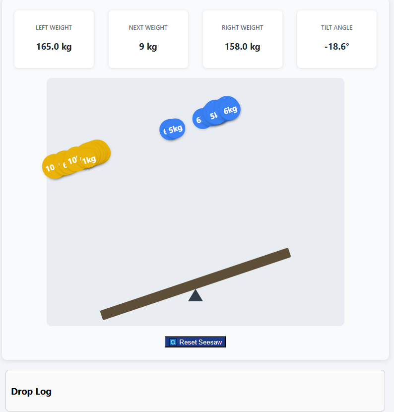
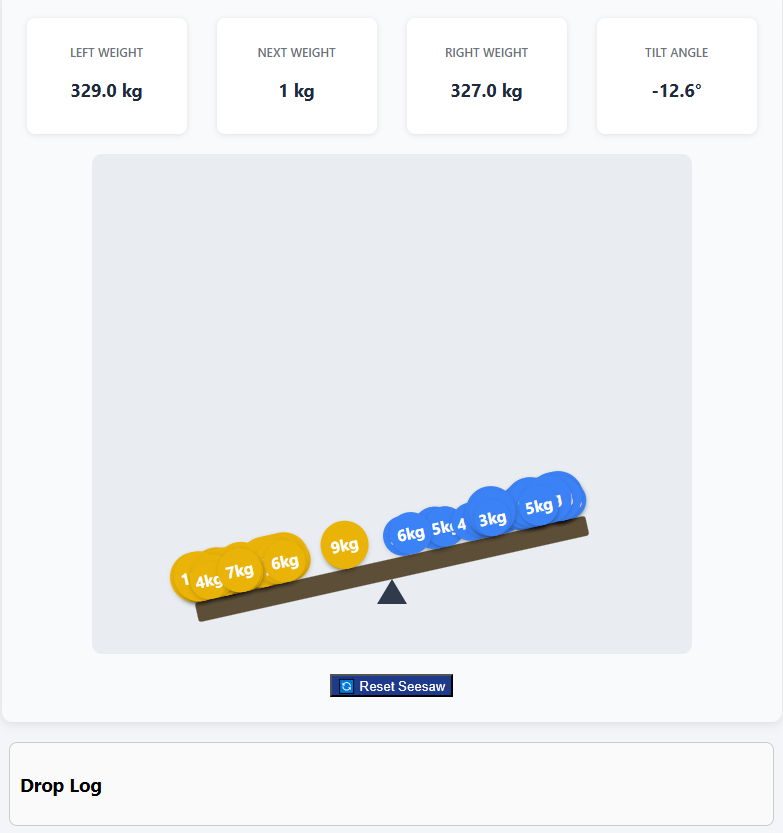
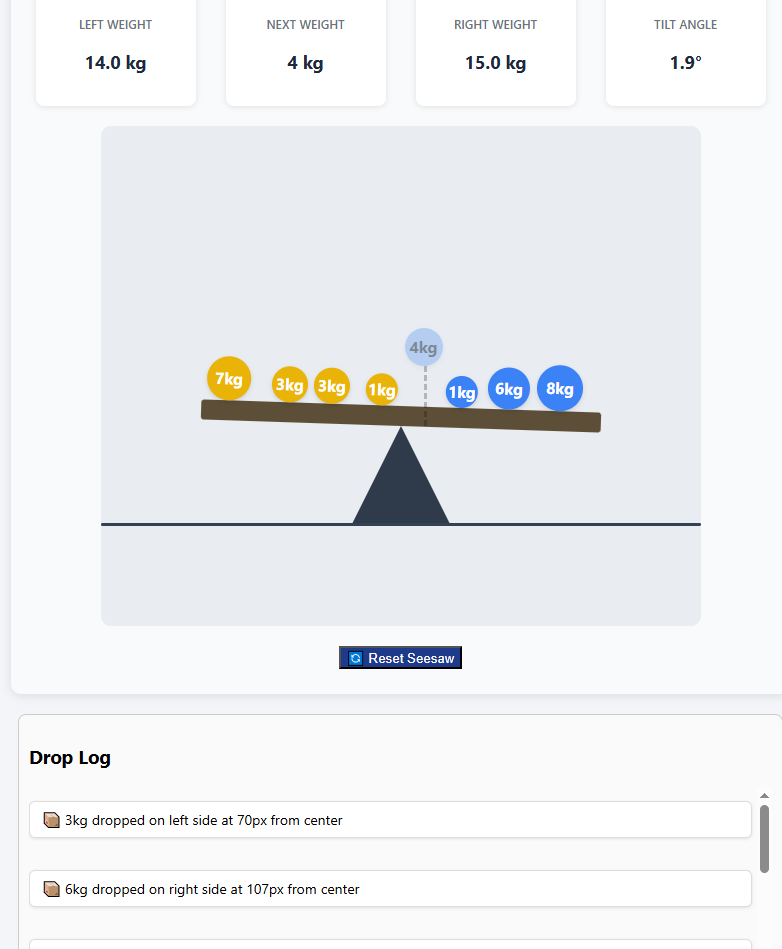

# GOKTUG_KOCAUSU_SEESAW
Göktuğ Kocauşu's seesaw project

Now im commiting, when i clicking to the plank objects falls. the tilt works excellent and info boxes are working too. When I refresh the page everything stays thats awesome too.
only problem for now, objects dont stay on the plank. I'm going to fix them on the next commit.

Bug fixed now we have animations for object(dropping like rain) and objects sorted on plank.

Preview object and line added. These features helps us to aim the ball where we want exactly to the drop. 
Also I made the pivot point bigger and added ground visiually for better user experience. Because our seesaw tilt's max + - 30. With ground element, Its simulates seesaw touches to the ground so cant tilt more. If there is no ground seesaw can go more down or up.