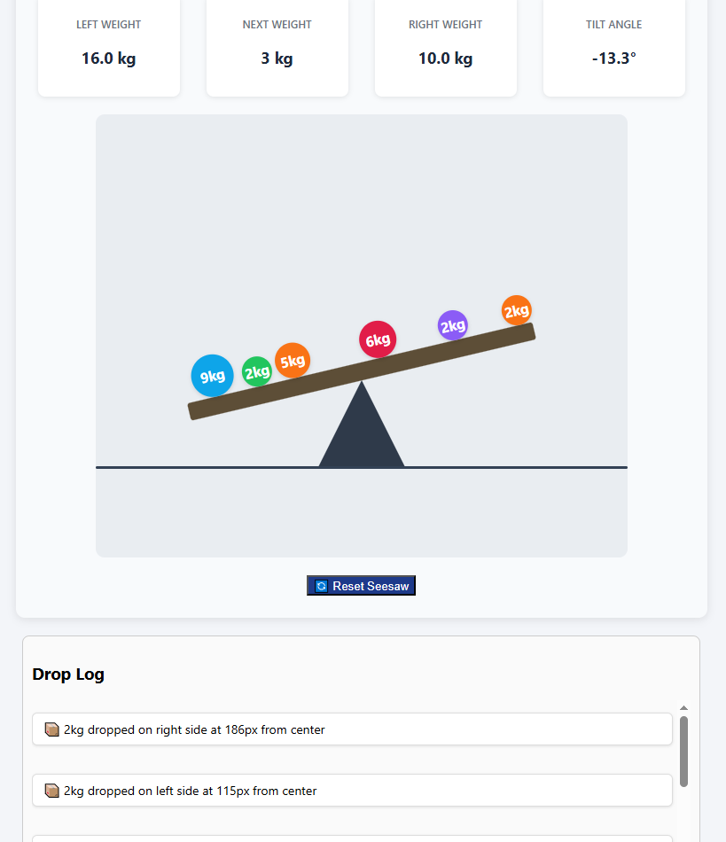

# GOKTUG_KOCAUSU_SEESAW
Göktuğ Kocauşu's seesaw project process part

When I click to the plank objects falls, the tilt works excellent and info boxes are working too. When I refresh the page everything stays thats awesome too.
only problem for now, objects dont stay on the plank. I'm going to fix them on the next commit.

Bug fixed now we have animations for object(dropping like rain) and objects sorted on plank.

Preview object and line added. These features helps us to aim the ball where we want exactly to the drop. 
Also I made the pivot point bigger and added ground visiually for better user experience. Because our seesaw tilt's max + - 30. With ground element, It simulates seesaw touches to the ground so cant tilt more. If there is no ground, seesaw can go more down or up.

I've changed the color of the balls. Now they are randomly choosing between 5 different color.
When user clicked to the plank animation sound comes out. These are a user friendly features.
Also I've mentioned about the +30 -30 tilt angle, now when our seesaw hit to the ground 'bzzz' sound comes out for emphasise the seesaw can't go further.

General Part about the project
Core Features

Physics-Based Tilt: The seesaw tilts based on the torque difference (Torque = Weight x Distance).

Angle Limit: The plank's tilt is correctly capped at -30 and +30 degrees.

Data Persistence: localStorage is used to save the state of objects, logs, and the next weight.

Clickable Area: The click event listener is correctly bound only to the plank element.

Bonus Features

Preview Object: A semi-transparent preview of the next object appears on hover.

Projection Line: A dashed line projects from the preview object down to the plank.

Drop Animation: Objects animate falling from the air onto the plank.

Visual Limit: A static "ground" line and an enlarged pivot point.

Drop Sound: A "bloop" sound plays on every drop.

Hit Sound: A "hit" sound plays when the plank hits the 30-degree limit.

Reset Button: Clears all objects, logs, and localStorage data.

Event Log System: Details of every dropped object are displayed in a log box.

Random Colors: Objects are assigned one of 5 vibrant, random colors.
How It Works (My Approach)

Saving the State: I used localStorage to save the game's state (the objects and logs arrays). This is the simplest and most effective way to handle persistence for a project of this scale without any external libraries.

Getting the Tilt Right: The formula suggested in the document (/ 10) was a bit too sensitive. I adjusted this to (torqueDifference / 100) to get a smoother and more visually appealing tilt.

Adding Sound (No MP3s!): To keep the project pure and avoid external files, I used the browser's built-in Web Audio API. I created the "bloop" and "thud" sounds.

Limitations (Trade-offs)

The simulation does not account for stacking or rolling. Objects exist at a single point on the x-axis.

The physics is not a real-time engine; it's a static balance that is re-calculated instantly on each new click.

Clicking a tilted plank can be tricky. When the plank is very tilted, clicking on the visual left side (what you see) might accidentally drop the object on the actual right side. This is because the click position is calculated for the flat plank, not the rotated one.

Project is responsive but, If the clickable areas are too small, usability will decrease on mobile devices — users might find it difficult to tap accurately.

AI Usage
It was helpful for catching small, overlooked errors (for example, typos like "function HitSound" when it should have been "hitSound", or "ReferenceError" for an undefined variable).

I also used it as a "second pair of eyes" to proofread and catch small mistakes while writing this "README.md" file. The core logic and implementation were written by me.